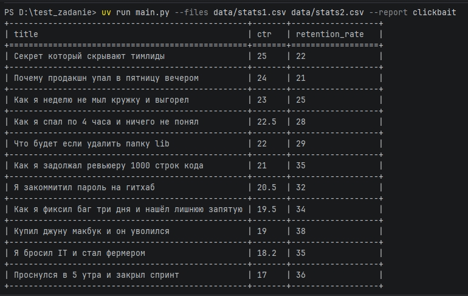

## YouTube Clickbait Reporter
Инструмент для выявления видео с аномальным соотношением CTR (>15%) и удержания (<40%).

Архитектура: Проект спроектирован по принципу OCP - логика отчетов вынесена в отдельные классы (наследники BaseReport), что позволяет добавлять новые типы аналитики без изменения существующего кода.

Обработка данных: Реализован отказоустойчивый парсинг CSV. При некорректных типах данных в строках программа не падает, а выводит предупреждение и продолжает работу.

Тестирование: Покрытие кода - 89%. Написаны Unit-тесты для логики фильтрации и интеграционные тесты для проверки CLI-интерфейса.

Инструментарий: Использованы Uv для управления зависимостями (гарантия воспроизводимости через lock-файл), Ruff для линтинга и Pytest для тестов.

uv run pytest --cov=.

## Скриншот работы

